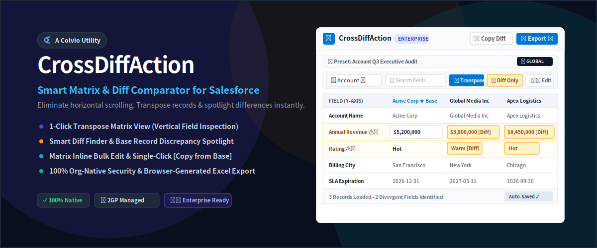
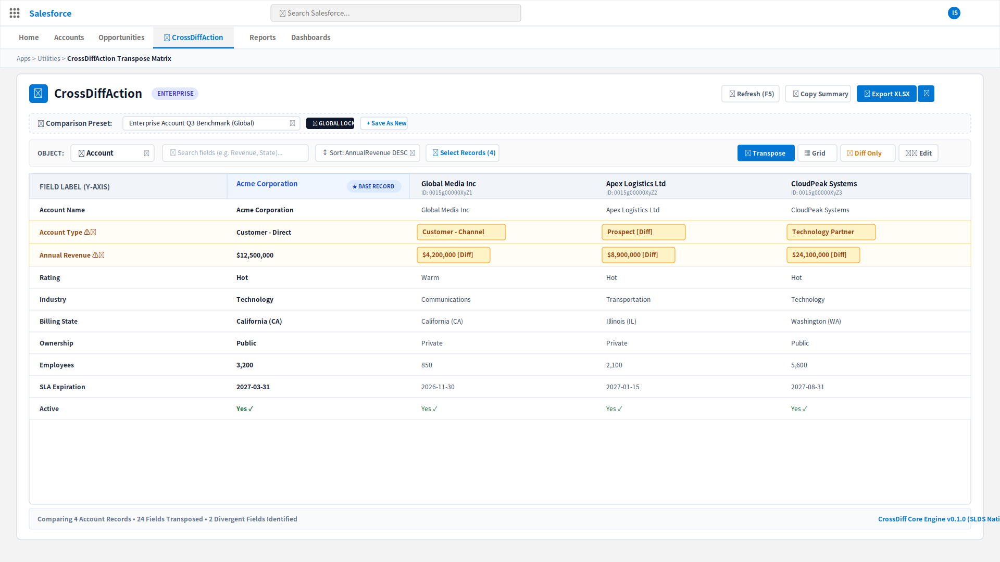
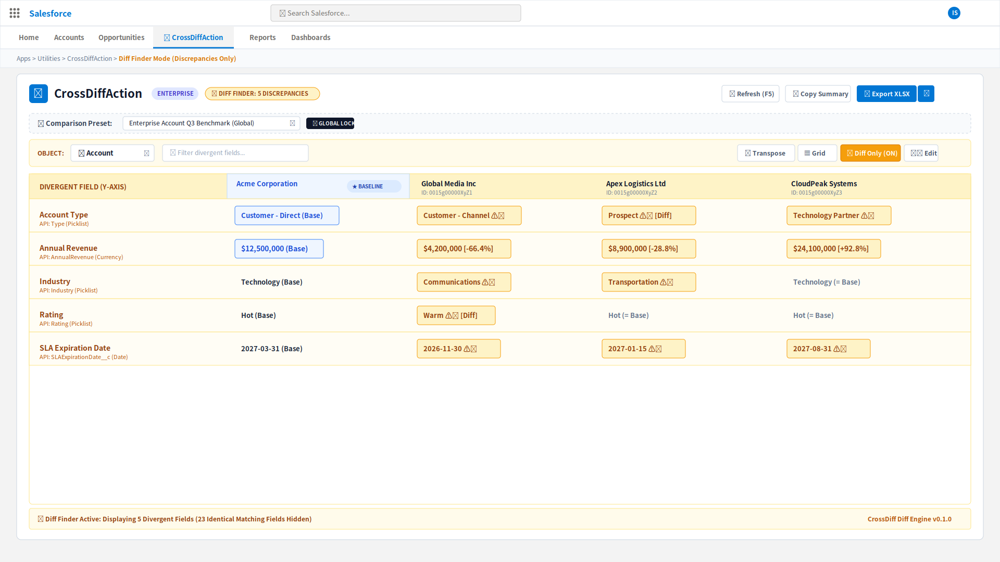
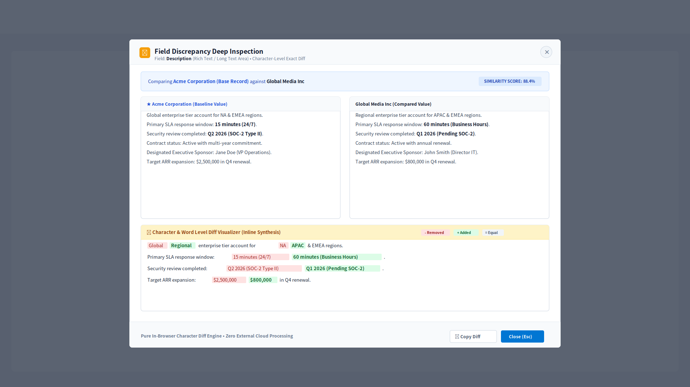
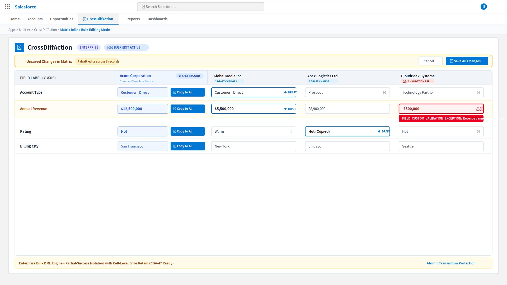
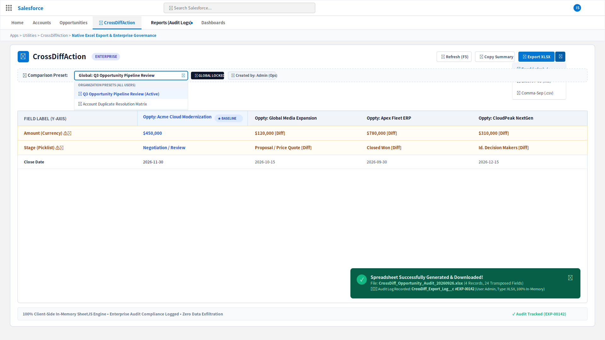
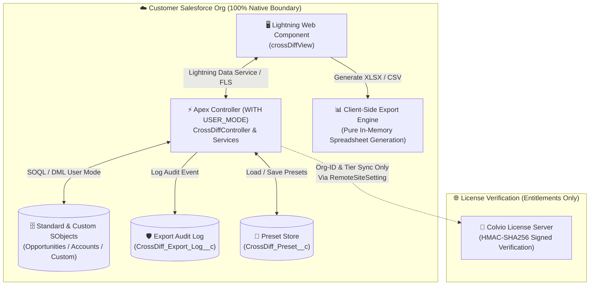

# CrossDiffAction (CrossDiff)

### ☷ Smart Matrix & Diff Comparator for Salesforce

*Colvio Studio Flagship Commercial Utility*

 

  

**Tired of endless horizontal scrolling in Salesforce standard list views?** 
**Rotate records into a clean vertical matrix, pinpoint discrepancies in seconds, and bulk-edit with zero friction.**

[**Explore on Colvio.io**](https://colvio.io) • [**AppExchange Listing**](https://appexchange.salesforce.com) • [**Admin Setup Guide**](docs/customer/ADMIN_SETUP_GUIDE.md) • [**User Guide**](docs/customer/USER_GUIDE.md) • [**Report an Issue**](https://github.com/colvio-studio/cross-diff-action/issues)

---

## 💡 Why CrossDiffAction?

Salesforce standard list views force users to scroll horizontally across 30+ columns to compare competing Opportunities, verify duplicate Accounts, audit Case resolutions, or inspect custom objects. Subtle discrepancies often slip through unnoticed, leading to data degradation and lost revenue.

**CrossDiffAction (CrossDiff)** solves this friction by transposing your data: **fields run vertically down the Y-axis, while records align side-by-side along the X-axis**. With instant Diff Finder filtering, baseline comparisons, deep character-level rich text diffs, and client-side Excel exports, CrossDiff turns tedious manual audits into a single-click superpower.

---

## ✨ Key Capabilities & Visual Walkthrough

### 1. ☷ 1-Click Transpose Matrix View (Account & Opportunity Benchmarking)
Rotate any standard or custom Salesforce object into a vertical matrix. Compare up to dozens of records side-by-side without horizontal table clipping. Includes 3-tier multi-column sorting and a pinpoint record search picker.

  

---

### 2. ⚡ Smart Diff Finder & Baseline Discrepancy Spotlight
Activate **Diff Only** mode with a single click. Identical rows are instantly collapsed, spotlighting only the divergent values with signature high-contrast amber badges (`#FEF3C7`). Designate any record as the **Baseline (★ Base)** to calculate all variances dynamically.

  

---

### 3. 🔍 Side-by-Side Character & Word Level Diff Modal
Auditing long text, contract clauses, or rich text descriptions? Launch the deep inspection modal to view character-level inline diffs (red for deleted/original text, green for added/new text) computed client-side via our proprietary zero-dependency LCS Diff engine.

  

---

### 4. ✏️ Matrix Inline Bulk Edit, [Copy from Base], & Atomic DML
Edit picklists, currencies, numbers, and text fields directly within the matrix. Cascade standard values across all comparison records using **Copy from Base**. When saving, atomic DML protections isolate partial-success records and retain unsaved errors with clear red-border highlights and field-level error messages.

  

---

### 5. 📥 Client-Side In-Memory Excel / CSV Export & Enterprise Governance
Download formatted `.xlsx`, legacy `.xls`, or UTF-8 BOM `.csv` spreadsheets generated entirely within your browser sandbox. For Enterprise teams, CrossDiff features **Organization-Wide Locked Presets** (`CrossDiff_Preset__c`) and **Automated Export Audit Logging** (`CrossDiff_Export_Log__c`) with native custom report types.

  

---

## 🛡️ Enterprise Security & Architecture (100% Native)

CrossDiff operates **100% inside your Salesforce Org runtime**. 

- **Zero Business Data Callouts**: CRM records, customer metadata, and export files never leave your Salesforce boundary.
- **Strict FLS & CRUD Enforcement**: Built with Apex `WITH USER_MODE` and programmatic Field-Level Security verification. Unauthorized fields are masked automatically.
- **Cryptographic License Verification**: License entitlements are verified via HMAC-SHA256 signatures with protected custom metadata and dedicated sandbox multi-tenant routing.

---

## 🚀 Quick Start (5 Minutes)

### Step 1: Install Package
Click **Get It Now** on the [AppExchange](https://appexchange.salesforce.com) or deploy the 2GP Managed Package into your Sandbox / Production environment:
- **Package ID (04t)**: `04td5000000VuKTAA0` (Version: `0.1.0.1` / `CrossDiffAction@0.1.0-1`)
- **Direct Install Link**: [https://login.salesforce.com/packaging/installPackage.apexp?p0=04td5000000VuKTAA0](https://login.salesforce.com/packaging/installPackage.apexp?p0=04td5000000VuKTAA0)

### Step 2: Assign Permission Sets
Assign one of the bundled permission sets to your users:
- `CrossDiff_Admin`: Full access to preset management, global locking, license configuration, and audit logging.
- `CrossDiff_User`: Standard end-user access to matrix view, diff finder, inline editing, and exports.

### Step 3: Add to Record Page or App
1. Navigate to **Setup** ➔ **App Builder** ➔ Edit any Record Page (e.g. `Opportunity`) or App Page.
2. Drag and drop the **`CrossDiffView`** custom component onto the canvas.
3. (Optional) Configure `allowedObjects` in the component properties panel to restrict comparisons to specific objects.
4. Save and Activate!

---

## 🌍 Global Multi-Language Support

CrossDiffAction comes pre-configured with native translation support across **8 major enterprise languages**:
- 🇺🇸 English (`en_US` - Default)
- 🇯🇵 Japanese (`ja` - 日本語)
- 🇩🇪 German (`de` - Deutsch)
- 🇫🇷 French (`fr` - Français)
- 🇪🇸 Spanish (`es` - Español)
- 🇨🇳 Simplified Chinese (`zh_CN` - 简体中文)
- 🇹🇼 Traditional Chinese (`zh_TW` - 繁體中文)
- 🇰🇷 Korean (`ko` - 한국어)

---

## 📦 Pricing & Commercial Editions

| Edition | Price | Target Audience | Key Features |
| :--- | :--- | :--- | :--- |
| **Standard** | **$9** /user/month | Small Teams & Sales Ops | Transposed Matrix, Diff Finder, Base Record Comparator, CSV Export, Personal Presets |
| **Professional** | **$15** /user/month | Growth Businesses | All Standard features + Character Diff Modal, Inline Bulk Edit, Copy from Base, XLSX Export |
| **Enterprise** | **Custom** (Volume/Contract) | Large Enterprise & Regulated | All Pro features + Organization-Wide Locked Presets, Automated Export Audit Logs, Priority SLA |

---

## 📚 Complete Documentation Sitemap

- **Admin & Setup**:
  - 📋 [**Admin Setup Guide (English)**](docs/customer/ADMIN_SETUP_GUIDE.md)
  - 🇯🇵 [**管理者セットアップガイド（日本語）**](docs/customer/ADMIN_SETUP_GUIDE_JA.md)
- **User Guides**:
  - 👤 [**End User Guide (English)**](docs/customer/USER_GUIDE.md)
  - 🇯🇵 [**エンドユーザー操作マニュアル（日本語）**](docs/customer/USER_GUIDE_JA.md)
- **Enterprise & Governance**:
  - 🛡️ [**Enterprise Customization & Governance Guide (English)**](docs/customer/ENTERPRISE_CUSTOMIZATION_GUIDE.md)
  - 🇯🇵 [**エンタープライズカスタマイズガイド（日本語）**](docs/customer/ENTERPRISE_CUSTOMIZATION_GUIDE_JA.md)
- **Security & Quality**:
  - 🔒 [**AppExchange Security Review Testing Instructions**](docs/marketplaces/appexchange/security-review/SECURITY_REVIEW_TESTING_INSTRUCTIONS.md)
  - 📊 [**Data Flow & Security Architecture**](docs/marketplaces/appexchange/security-review/DATA_FLOW_AND_SECURITY.md)
  - 🛡️ [**Security Policy & Responsible Disclosure (SECURITY.md)**](SECURITY.md)
  - 📄 [**Internal Developer Overview (日本語)**](docs/architecture/INTERNAL_DEVELOPMENT_OVERVIEW_JA.md)

---

## 💬 Support & Inquiries

- **Email Support**: [support@colvio.io](mailto:support@colvio.io) (Guaranteed 24-hour asynchronous SLA)
- **Issue Tracker**: [GitHub Issues](https://github.com/colvio-studio/cross-diff-action/issues)
- **Studio Portal**: [https://colvio.io](https://colvio.io)
- **Privacy Policy**: [https://colvio.io/privacy](https://colvio.io/privacy)
- **Terms of Service**: [https://colvio.io/terms](https://colvio.io/terms)

---

  Crafted with boutique precision by <a href="https://colvio.io"><strong>Colvio Studio</strong></a>. Clever Utilities, Frictionless Workflows.

